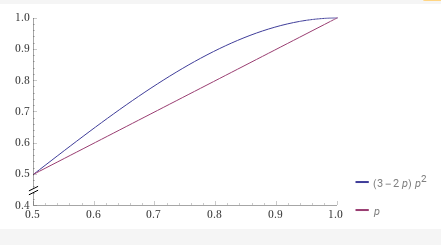

# Bernoulli Boolean Model

A Boolean value, represented as `bool` in C++, can either be `true` or `false`. This document entertains the replacement of `bool` with a type `bernoulli<bool,K>`, which represents a Bernoulli type for Booleans over the equality operator.

## The Bernoulli Boolean model

In the Bernoulli Boolean model, a Boolean value `x` is wrapped in a Bernoulli type `bernoulli<bool,K>{x}`. This value `x` is a *latent* variable - not directly observable - and can be thought of as a measurement, or a noisy version of the original `x`.

The Bernoulli model introduces a notion of uncertainty or error into the Boolean model. Specifically, a `bernoulli<bool,K>{x}` is a *random variable* such that
```cpp
Pr{bernoulli<bool,K>{x} == x} == p(x)
```
where `0 < p(x) < 1` is the probability of no error and `1-p(x)` is the probability of an error. In most practical situations, the probability `p(x)` is known and can be adjusted to balance factors like space complexity and accuracy.

> Note that the Bernoulli Boolean model is equivalent to the Boolean model for values with an error probability of 0 or 1.

### Binary Channels

The Bernoulli Boolean model can exhibit two distinct behaviors, represented as different "channels" through which Boolean values are transmitted:

1. **Binary Symmetric Channel (First-order Bernoulli model)**: The probability of an equality error is the same for `true` and `false`. If `p = 1` and we know `p = 1`, this channel is equivalent to a *perfect channel* where no noise is introduced. 

Here's an ASCII diagram of a *binary symmetric channel*:
```
        +-- 1-p --> 0
        |
1 ------+
        |
        +--- p ---> 1
```

2. **Binary Asymmetric Channel (Second-order Bernoulli model)**: The probability of an equality error differs for `true` and `false`.

## False Positives and Negatives

Errors in the Bernoulli Boolean model can be understood in terms of *false negatives* and *false positives*:

1. `bernoulli<bool,K>{false} == true` is a *false negative*.
2. `bernoulli<bool,K>{true} == false` is a *false positive*.

In the first-order model, the probability of a false negative equals the probability of a false positive. In the second-order model, these probabilities differ.

In a specific but common version of the second-order Bernoulli Boolean model, false
negatives occur with probability 0 and false positives occur with probability
`0 < p < 1`.

## Predicting `x` from `bernoulli<bool,K>{x}`

`bernoulli<bool,1>{x}` is *correlated* with `x`, and ideally, `bernoulli<bool,1>{x}` 
provides evidence for `x`, i.e., allows one to predict `x` given
`bernoulli<bool,1>{x}` better than if given no observation whatsoever.
If the probability of no error `p(x)` is `<= 0.5` and we have no prior information about `x`, the best (ML) estimate of `x` is the observation `bernoulli<bool,K>{x}`. 

However, with prior information about `x`, we can estimate the probability that the latent variable `x` is `true` or `false`. Using Bayes' rule, the probability that `bernoulli<bool,K>{x}` is correct is:

```cpp
Pr{x == true | bernoulli<bool,K>{x} == true} ==
    Pr{bernoulli<bool,K>{x} == true | x == true } * Pr{x == true}
    ---------------------------------------------------------------
        Pr{bernoulli<bool,K>{x} == true | x == true} * Pr{x == true} +
        Pr{bernoulli<bool,K>{x} == true | x == false} * (1-Pr{x == true})
```

In the first-order model, if the probability of no error is `q`, then:

```cpp
Pr{x == true | bernoulli<bool,1>{x} == true} ==
    q * Pr{x == true}
    ---------------------------------------------
    q * Pr{x == true} + (1-q) * (1-Pr{x == true})
```

Assuming maximum ignorance (maximum entropy) about `x` (i.e., `Pr{x == true} == 0.5`), the following expression is obtained:

```cpp
Pr{x == true | bernoulli<bool,K>{x} == true} == q
```

One could even imagine having multiple sources of, say, noisy i.i.d. measurements
of the same `x`. For instance, suppose `x == true` but we don't know that and we have
`3` measurements of `x`.
```
x1' = bernoulli<bool,1>{true} == true
x2' = bernoulli<bool,1>{true} == false
x3' = bernoulli<bool,1>{true} == true
```

This is more information about `x` than just one noisy observation. Clearly,
and informally, the best prediction for the value of `x` is the majority vote,
which is `true` in this case.

Consider this. The number of `true` values is Binomially distributed with parameters `n=3` (independent trials) and probability `p`, so we let `N ~ BIN(3,p)` denote the
random variable representing the number of `true` values in `x1',x2',x3'`.

Let's do a case by case analysis to compute the probability that the above majority 
vote is correct. First, for the majority vote to be correct, `N >= 2`, which means
that `N == 2` or `N == 3`.

1. The probability that `N == 2` is `Pr{N == 2} = 3 * p^2 * (1-p)`.

2. The probability that `N == 3` is `Pr{N == 3} = p^3`.

Therefore, the probability of no error is `3 * p^2 * (1-p) + p^3`. If `p = 0.5` (maximum ignorance), we get a no error rate of `0.5`, as intuitively expected.
For `p = 1`, we get a no error rate of `1`, which is also intuitively expected.
The no error rate of a single observation, of course, is just `p`.
Let's plot these two no error rates together:



We see a slight improvement in the no error rate when we have multiple noisy
observations of the same latent variable. As the number of independent sources
goes to infinity, the error rate goes to 0.

This is not a typical use-case for the Bernoulli Boolean model, since it will
mostly be a analytical result of probabilistic data structures that may be framed
in the context of a Bernoulli model, but it is interesting to see how the model
 behaves in this case.

## Inducing Bernoulli types

If we have a function `f : bool -> bool`, then the space of all possible functions
is given by Table 1.

Table 1: All possible functions `f : bool -> bool`

| f     | f(true) | f(false) |
|-------|---------|----------|
| id    | true    | false    |
| not   | false   | true     |
| true  | true    | true     |
| false | false   | false    |

It may be interesting to consider what happens when we replace the Boolean inputs
with Bernoulli boolean values and ask the question, "What is the probability that
`f(bernoulli<bool,1>{x}) == f(x)`?"

Notice that `f(bernoulli<bool,1>{x})` is `f(x)` with some probability, but `f(x)` 
may be latent depending on `f`.

For the constant fuctions, `true` and `false`, we get the same
function, i.e., `true(bernoulli<bool,1>{true}) == true` since `true : bool -> bool`
always outputs `true`, and similiarly for `false : bool -> bool`.

However, the `id` and `not` functions are different. For instance, suppose
`Pr{bernoulli<bool,1>{x} == x} == p`. Then, when we input `bernoulli<bool,1>{true}`
into `id`, we get the correct output `true` with probability `p` and the incorrect
output `false` with probability `1-p`. Likewise, when we input `bernoulli<bool,1>{false}` into `id`, we get the correct output `id(true) == false` with probability
`p` and the incorrect output `f(false) == true` with probability `1-p`, and a
similar story for `not`.

Since we can think of these outputs as either correct or incorrect with probability
`p`, we can call them Bernoulli Boolean values too, e.g., 
```cpp
    id : bernoulli<bool,1> -> bernoulli<bool,1>
```

What is this function? It's just `id`, but it has been monadically lifted into
the Bernoulli Boolean model. Notice also that this is distinct from the type
```cpp
    id<bool,1> : bool -> bernoulli<bool,1>
```
which is what we say is a Bernoulli map from `bool` to `bernoulli<bool,1>`. In this
case, it is a first-order Bournoulli map on the equality of its output, i.e.,

```cpp
    Pr{id<bool,1>(x) == id(x)} == p
```
Since functions are values, we can also ask the question, what is the probability
that `id<bool,1> == id`? In this case, we are asking about the equality of the
functions, which is mathematically equivalent to asking whether each input in
the domain maps to the same output, i.e.,
```cpp
    Pr{id<bool,1>(true) == id(true) && id<bool,1>(false) == id(false)}
```
Since this is a first-order model, the probability that both conditions are true
is just the product of the probabilities of each condition being true, i.e.,
```cpp
Pr{id<bool,1>(true) == id(true)} * Pr{id<bool,1>(false) == id(false)} = p^2.
```

Let's fix `p` and consider the total space of functions for `id : bool -> bool`.

Table 2: `bernoulli_id<1> : bool -> bernoulli<bool,1>`

| id    | `Pr{bernoulli_id(x)} = x` | `Pr{bernoulli_id(x)} != x` |
|-------|---------------------------|----------------------------|
| true  | p                         | 1-p                        |
| false | p                         | 1-p                        | 

Let's consider `bernoulli_id<2> : bool -> bernoulli<bool,2>`.

Table 3: `bernoulli_id<2> : bool -> bernoulli<bool,2>`

| id    | `Pr{bernoulli_id(x)} = x` | `Pr{bernoulli_id(x)} != x` |
|-------|---------------------------|----------------------------|
| true  | true positive rate        | false negative rate        |
| false | true negative rate        | false positive rate        |


### Noisy Turing machines: noisy logic gates
As we consider more complex compound data types, which may always be modeled as
functions, we will see that there are many ways these types can participate
in the Bernoulli Boolean model. When a Bernoulli value is introduced into the
computational model, the entire computation outputs a final result that is
a Bernoulli type.

The easiest way to think about this is to just consider a Universal Turing machine
in which we build programs by composing circuits of binary logic-gates, like `and`,
`or`, and `not`. In general, if we replace a single input into the circuit with a
Bernoulli Boolean, the output of the circuit is a an array of Bernoulli Booleans.
Moreover, and more interestingly, we can replace some of the logic gates with
noisy logic-gates, or Bernoulli logic-gates, and the output of the circuit is
a Bernoulli Boolean.

So, let's consider the set of binary functions
`f : (bool, bool) -> bool`. 

There are 2^2 = 4 possible functions `f : bool -> bool` since for each possible
input, `true` or `false`, we have two possible outputs, `true` or `false`.

> More generally, if we have `f : X -> Y`, then we have `|Y|^|X|` possible functions, where `|.|` denotes the cardinality of a set. For instance, if `X = (bool, bool)` and `Y = bool`, then we have `2^4 = 16` possible functions, since `|X| = 4` and `|Y| = 2`.

Each of these functions has a designated name, which we can use to refer to them,
like `and`, `xor`, etc. However, we are just going to look at `and`.

Table 4: `and : (bool, bool) -> bool`

| `x1` | `x2` | `and(x1, x2)` |
|------|------|---------------|
| true | true | true          |
| true | false| false         |
| false| true | false         |
| false| false| false         |

Now, let's consider
```cpp
and : (bernoulli<bool,1>, bernoulli<bool,1>) -> bernoulli<bool,2>`
```

This is more complicated than might first seem. An error occurs if
`and` returns `true` when it should return `false`, or vice versa. The input
variables represent *latent* values, so they do not have a definite value.


We will go row by row, and examine the probability that the output is correct for
each pair of inputs.

Firt, if `x1 = bernoulli<bool,1>{true}` (the latent variable is `true`, an but apriori
), and `x2 = bernoulli<bool,1>{true}`, then the output is

Table 5: `and : (bernoulli<bool,1>, bernoulli<bool,1>) -> bernoulli_bool<?>`

| `x1` | `x2` | `and(x1,x2)` | `Pr{and(x1, x2)} == and(x1, x2)}` |
|------|------|--------------------------------------------------|
| true | true | 1            | `p1 * p2`                 |
| true | false| 0            | 1-p                        |
| false| true | 0            | 1-p                        |
| false| false| 0            | 1-p                         |


We can consider this row-by-row.


Since functions are values, we can also ask the question, what is the probability
that `id<bool,1> == id`? In this case, we are asking about the equality of the
functions, which is mathematically equivalent to asking whether each input in
the domain maps to the same output, i.e.,
```cpp
    Pr{id<bool,1>(true) == id(true) && id<bool,1>(false) == id(false)}
```
Since this is a first-order model, the probability that both conditions are true
is just the product of the probabilities of each condition being true, i.e.,
```cpp
Pr{id<bool,1>(true) == id(true)} * Pr{id<bool,1>(false) == id(false)} = p^2.
```
