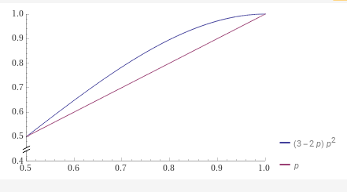

# The Bernoulli Model: A Closer Look at the Boolean Bernoulli Model


The Boolean type, represented as `bool` in C++, models the set of values
given by `{true,false}`. This document entertains the replacement of `bool` with a
type `bernoulli<bool>`, which represents a sort of *noisy* Boolean. In general, we
can have a Bernoulli type for any type `T`, denoed by `bernoulli<T>`.

Each Bernoulli Model also has an *order*, an integer greater than 1, and 
it essentially describes the number of independent ways in which the process that
generated the Bernoulli approximation can produce errors. We denote that a Bernoulli
Model has order `K` with `bernoulli<T,K>`. Unless it is useful, we drop the order
information and simply write `bernoulli<T>`.

> As special case, data structures like Bloom filters can be thought of as a
> Bernoulli data structure.

In the Bernoulli Boolean model, a `bool` is wrapped inside of a Bernoulli type
`bernoulli<bool>`. We use the notation `bernoulli<bool>{x}` to denote that
it is modeling some *latent* variable `x` (unobservable). We can think of
`bernoulli<bool>{x}` as a measurement of `x`, or a noisy version of the original
`x`, and it may or may not equal `x`.

The Bernoulli model introduces a notion of uncertainty or error. Specifically, a
`bernoulli<bool>{x}` is a *random Bernoulli variable* such that
```cpp
Pr{bernoulli<bool>{x} == x} == p(x)
```
where `0 < p(x) < 1` is the probability of being correct and `1-p(x)` is the
probability of an error. In most practical situations, the probability `p(x)` is
known and can be adjusted to balance factors like space and accuracy.

## Motivation

A big reason for developing the Bernoulli Model formalism is so that we can use
Bernoulli Models of data types to develop Oblivious Data Types. We will
go into that in a separate document, but the basic idea is that Bernoulli
approximations have a lot of desirable properties for developing
oblivious data types, and the Bernoulli Model formalism allows us to reason about
the correctness of the oblivious data types and to make them more space-efficient
by trading accuracy for space while allowing for `O(1)` time complexity.

The Bernoulli Model also provides a formalism for how to think about various
probabilistic data structures, like the Bloom filter, Count-Min sketch, or my
invention, the Bernoulli data type, which comprises an entire family of data
structures that are all based on the Bernoulli Model, from sets (like the Bloom
filter) to maps in a near-space optimal way, while allowing for more savings
by trading accuracy for space in a controlled way.

In this paper, we narrow our focus to the Boolean Bernoulli Model, which is
the simplest Bernoulli Model. Later in this document, we consider
Bernoulli Models for Boolean functions too, since it provides a natural opportunity
to think about the model in a more general way.

## Binary Channels

Let's begin by thinking about the Binary Symmetric Channel and the
Binary Asymmetric Channel.
The Bernoulli Boolean model can exhibit two distinct behaviors, represented as
different "channels" through which Boolean values are transmitted:

1. **Binary Symmetric Channel (First-order Bernoulli model)**: The probability of an
equality error is the same for `true` and `false`. We denote this by the type
`bernoulli<bool,1>`.

2. **Binary Asymmetric Channel (Second-order Bernoulli model)**: The probability of
an equality error differs for `true` and `false`. We denote this by the type
`bernoulli<bool,2>`.

## False Positives and Negatives

Errors in the Bernoulli Boolean model can be understood in terms of
*false negatives* and *false positives*:

1. `bernoulli<bool>{false} == true` is a *false negative*.
2. `bernoulli<bool>{true} == false` is a *false positive*.

In the first-order model, the probability of a false negative equals the probability
of a false positive. In the second-order model, these probabilities differ.
In a specific but common version of the second-order Bernoulli Boolean model, false
negatives occur with probability 0 and false positives occur with probability
`0 < \varepsilon < 1`.

## Prediction

`bernoulli<bool>{x}` is *correlated* with `x`, and ideally, `bernoulli<bool>{x}` 
provides evidence for `x`, i.e., allows one to predict `x` given
`bernoulli<bool>{x}` better than if no observations where given whatsoever.
If the probability of correct `p(x)` is `<= 0.5` and we have no prior information
about `x`, the best (ML) estimate of `x` is the observation `bernoulli<bool>{x}`. 

However, with prior information about `x`, we can estimate the probability that the
latent variable `x` is `true` or `false`. Using Bayes' rule, the probability that
`bernoulli<bool>{x}` is correct is:

```cpp
Pr{x == true | bernoulli<bool>{x} == true} ==
    Pr{bernoulli<bool>{x} == true | x == true } * Pr{x == true}
    /
    (Pr{bernoulli<bool>{x} == true | x == true} * Pr{x == true} +
    Pr{bernoulli<bool>{x} == true | x == false} * (1-Pr{x == true}))
```

In the first-order model, if the probability of being correct `q`, then:
```cpp
Pr{x == true | bernoulli<bool,1>{x} == true} ==
    q * Pr{x == true}
    /
    (q * Pr{x == true} + (1-q) * (1-Pr{x == true}))
```

Assuming maximum ignorance (maximum entropy) about `x` (i.e.,
`Pr{x == true} == 0.5`), the following expression is obtained:
```cpp
Pr{x == true | bernoulli<bool,1>{x} == true} == q
```

One could even imagine having multiple sources of, say, noisy i.i.d. measurements
of the same `x`. For instance, suppose `x == true` but we don't know that and we have
`3` measurements of `x`.
```cpp
y1 = bernoulli<bool,1>{true} == true
y2 = bernoulli<bool,1>{true} == false
y3 = bernoulli<bool,1>{true} == true
```

This is more information about `x` than just one noisy observation. Clearly,
and informally, the best prediction for the value of `x` is the majority vote,
which is `true` in this case.

Consider this. The number of `true` values is Binomially distributed with parameters
`n=3` (independent trials) and probability `p`, so we let `N ~ BIN(3,p)` denote the
random variable representing the number of `true` values in `y1, y2, y3`.

Let's do a case by case analysis to compute the probability that the above majority 
vote is correct. First, for the majority vote to be correct, `N >= 2`, which means
that `N == 2` or `N == 3`.

1. The probability that `N == 2` is `Pr{N == 2} = 3 * p^2 * (1-p)`.

2. The probability that `N == 3` is `Pr{N == 3} = p^3`.

Therefore, the probability of no error is `3 * p^2 * (1-p) + p^3`. If `p = 0.5`
(maximum ignorance), we get a no error rate of `0.5`, as intuitively expected.
For `p = 1`, we get a no error rate of `1`, which is also intuitively expected.
The no error rate of a single observation, of course, is just `p`.
Let's plot these two no error rates together:



We see a slight improvement in the no error rate when we have multiple noisy
observations of the same latent variable. As the number of independent sources
goes to infinity, the error rate goes to 0.

This is not a typical use-case for the Bernoulli Boolean model, since it will
mostly be a analytical result of probabilistic data structures that may be framed
in the context of a Bernoulli model, but it is interesting to see how the model
 behaves in this case.

## Inducing Bernoulli types

If we have a function `f : bool -> bool`, then the space of all possible functions
is given by Table 1.

Table 1: All possible functions `f : bool -> bool`

| f     | f(true) | f(false) |
|-------|---------|----------|
| id    | true    | false    |
| not   | false   | true     |
| true  | true    | true     |
| false | false   | false    |

It may be interesting to consider what happens when we replace the Boolean inputs
with Bernoulli boolean values and ask the question, "What is the probability that
`f(bernoulli<bool,1>{x}) == f(x)`?"

Notice that `f(bernoulli<bool,1>{x})` is `f(x)` with some probability, but `f(x)` 
may be latent depending on `f`. For the constant fuctions, `true` and `false`, we
get the same function, i.e., `true(bernoulli<bool,1>{true}) == true` since
`true : bool -> bool` always outputs `true`, and similiarly for
`false : bool -> bool`.

However, the `id` and `not` functions are different. For instance, suppose
`Pr{bernoulli<bool,1>{x} == x} == p`. Then, when we input
`bernoulli<bool,1>{true}` into `id`, we get the correct output `true` with
probability `p` and the incorrect output `false` with probability `1-p`. Likewise,
when we input `bernoulli<bool,1>{false}` into `id`, we get the correct output
`id(true) == false` with probability `p` and the incorrect output `f(false) == true`
with probability `1-p`, and a similar story for `not`.

Since we can think of these outputs as either correct or incorrect with probability
`p`, we can call them Bernoulli Boolean values too, e.g., this is a function of
type
```cpp
    bernoulli<bool,1> -> bernoulli<bool,1>
```

What is this function? It's just `id`, but it has been monadically lifted into
the Bernoulli Boolean model. Notice also that this is distinct from the type
```cpp
    bool -> bernoulli<bool,1>
```
which is what we say is a Bernoulli map from `bool` to `bernoulli<bool,1>`. In this
case, it is a first-order Bournoulli map on the equality of its output, i.e.,
```cpp
    Pr{bernoulli<bool -> bool,1>{id}(x) == id(x)} == p
```

Notice what the notation suggests, too. We are writing `bernoulli<bool -> bool,1>{id}`
to indicate that the true value is `id` but what we *observe* is
`bernoulli<bool->bool,1>{id}`.
We cannot observe `id` directly. In fact, if we knew it was the identity function,
we already know the correct output. We are interested in the case where we don't
know the correct output, and all we are given as evidence is
the observation `bernoulli<bool->bool,1>{id}`.

So, we are applying the `bernoulli` concept to the function type `bool -> bool`,
which in this case only has 4 possibilities. Clearly, we normally would *not* use
a Bernoulli model for `bool -> bool`, and rather, the Bernoulli model would be
induced by some source of error, such as transmission over a noisy channel, as
previously described. We stick to this simple example for now, though, because
it is much more managable to work with, and we can generalize the results to
`X -> Y` where `X` and `Y` are arbitrary types, i.e., we observe
`bernoulli<X->Y,K>{f}` and wish to use that to compute the probability that
`f(x) = y` for some `x in X` and `y \in Y`.

Notice that we do not change the type of the input, `X`. This is a first-order
Bernoulli map. We can, of course, also provide as input to this function
a Bernoulli Boolean value, e.g., `bernoulli<bool,1>{true}`, and we will get a
an even higher-order Bernoulli Boolean value as output. In this case, we willl have
a higher-order Bernoulli map of type
```cpp
    bernoulli<bool,1> -> bernoulli<bool>
```
where for the output we drop the order information, and track the error rates
using interval arithmetic, whch we will discuss later.

Since functions are values, we can also ask the question, what is the probability
that `bernoulli<bool->bool,1>{id} == id`? In this case, we are asking about the
equality of the functions, which is mathematically equivalent to asking whether each
input in the domain maps to the same output, i.e.,
```cpp
Pr{bernoulli<bool->bool,1>{id}true) == id(true) &&
    bernoulli<bool->bool,1>{id}(false) == id(false)}
```
Since this is a first-order model, the probability that both conditions are true
is just the product of the probabilities of each condition being true, i.e.,
```cpp
Pr{bernoulli<bool->bool>,1>{id}(true) == id(true)} *
    Pr{bernoulli<bool->bool>,1>{id}(false) == id(false)} = p^2.
```

Let's fix `p` and consider the confusion matrix for the first-order
model, `bernoulli<bool->bool,1>`. We used the standard naming convention
for the outcomes of observations (`bernoulli<bool->bool,1>{f}(x)`) when compared
against the actuality (the latent `f(x)`), where TPR is the true positive rate, FNR is
the false negative rate, TNR is the true negative rate, and FPR is the false positive
rate. The confusion matrix is given by Table 2.

Table 2: First-Order Bernoulli Model for `bool -> bool` over Booleans

|                | observe `true` | observe `false` |
|----------------|----------------|-----------------|
| latent `true`  | TPR `p`        | FNR `1-p`       |
| latent `false` | FPR `1-p`      | TNR `p`         | 

Note that in the above, we are not discussing the input -- it is, after all,
observable in this case. We are only discussing the output, which is latent, since
we are pretending that we do not know we are dealing with, say, `id`. We are
only given the observation `bernoulli<bool->bool,1>{id}`. As mentioned previously,
there are only 4 possible functions of type `bool -> bool`, so if `p` is reasonably
small, we can probably estimate the true function with high confidence based on
examing inputs with expected outputs.

We might ask the question, can the order `N` in `bernoulli<bool->bool,N>` be greater
than 2? It is an interesting question. We only have two possible outcomes, `true`
and `false`, so how could we have a higher-order model? The answer is that we are
not tracking the order of the output, but rather, we are tracking the order of the
Bernoulli Boolean *function* approximation. Since we know the type, `bool -> bool`,
we know that there are only 4 possible functions.

Just as before, we knew we had a Boolean value. A Boolean value can only be `true`
or `false`. We can't observe the value directly, but we can observe a Bernoulli
approximation of the value. For each observed value, we can have unique probability
that the latent value is `true` or `false`.

Let's extend this to the discussion of functions of type `bool -> bool`. There are
only 4 possible functions of this type, `id`, `not`, `true`, and `false`.

Now suppose we are given a Bernoulli `bernoulli<bool->bool>{id}`.
We do not know that the latent function is `id`, we only know that we have a function
`bernoulli<bool->bool>{id}`, which can be either `id`, `not`, `true`, or `false`.
The best guess for `bernoulli<bool->bool>{id}` is the function that it matches,
assuming that the process that generates these approximations is unbiased.

Let's construct the confusion matrix for `bernoulli<bool->bool>`.

Table 3: Bernoulli Model for `bool -> bool`

| latent / observe | `id`  | `not` | `true` | `false` |
|------------------|-------|-------|--------|---------|
| `id`             | `p11` | `p12` | `p13`  | `p14`   |
| `not`            | `p21` | `p22` | `p23`  | `p24`   |
| `true`           | `p31` | `p32` | `p33`  | `p34`   |
| `false`          | `p41` | `p42` | `p43`  | `p44`   |

Each row must sum to 1, `\sum_j p_{i j} = 1`, so we only have up to a maximum of
`4 (4-1) = 12` degrees of freedom. This means the highest Bernoulli Boolean order is
12 (`bernoulli<bool->bool,12>`), but we normally drop the order and just write
`bernoulli<bool->bool>` and track the error rates using interval arithmetic, as
mentioned a few times previously.

Now, when we have a Bernoulli approximation of some latent function of type
`bool -> bool`, we wish to store the error information in the output so that we
can propagate it forward. We do this by saying that the output is a Bernoulli
Boolean, because it may or may not be correct, i.e., the Bernoulli process
`bernoulli<bool->bool>` generates a function of type `bool -> bernoulli<bool>`
rather than of type `bool -> bool`. In our algorithms, we created a type system
for this, and this extra information can be discarded when tracking errors 
is not needed.

So, what happens when we have a Bernoulli model `bernoulli<bool->bool>`, and
then we lift it to 
```cpp
bernoulli<bernoulli<bool>->bernoulli<bool>>
```
by providing `bernoulli<bool>` as input? When we compare
the true output with this lifted Bernoulli model, we still get a maximum order
of 12, but if the order is, say, 2, then this lifted model is likely to have
a higher order.

The order of the model is not necessarily that important, but it does complicate
estimation problems, and it is also *desirable* to have a higher order models in
some cases, for instance if we have an entropy coder, then we want the diagonal
of the confusion matrix to be as close to 1 as possible, and we want the off-diagonal
elements to be as close to 0 as possible, but when elements are not 0, we want
functions that are more similiar to the latent function to have larger probabilities
than functions that are less similiar to the latent function. This is just a way of
minimizing a loss function in ML, where the function truly is latent and we are
trying to find the best approximation to the latent function by minimizing a
loss function. The higher the order, the more capacity the model has to approximate
the latent function, but the more data we need to estimate the parameters of the
model.

ML is not really the target of the Bernoulli model, but it is a useful way to
think about the model. The Bernoulli model is really a way of thinking about
the uncertainty in the output of a function, and how that uncertainty propagates
through a computation, and typically the uncertainty is due to a trade-off
between space complexity and accuracy. The more space we use to represent
the function, the more closely it is expected to approximate the latent function.

## Noisy Turing machines: noisy logic gates
As we consider more complex compound data types, which may always be modeled as
functions, we will see that there are many ways these types can participate
in the Bernoulli Boolean model. When a Bernoulli value is introduced into the
computational model, the entire computation outputs a final result that is
a Bernoulli type, e.g., `bernoulli<pair<T1,T2>>`, `pair<T1,bernoulli<T2>`, and so
on.

The easiest way to think about this is to just consider a Universal Turing machine
in which we build programs by composing circuits of binary logic-gates, like `and`,
`or`, and `not`. In general, if we replace a single input into the circuit with a
Bernoulli Boolean, the output of the circuit is a one or more Bernoulli Booleans.
Moreover, and more interestingly, we can replace some of the logic gates with
noisy logic-gates, or Bernoulli logic-gates, and the output of the circuit is
also a Bernoulli Boolean. We can always discard information about the uncertainty
in the output of the circuit, and just get Boolean, but if the uncertainty is
non-negligible, then we may want to keep track of it.

So, let's consider the set of binary functions
`f : (bool, bool) -> bool`. 

There are 2^2 = 4 possible functions `f : bool -> bool` since for each possible
input, `true` or `false`, we have two possible outputs, `true` or `false`.

> More generally, if we have `f : X -> Y`, then we have `|Y|^|X|` possible functions,
> where `|.|` denotes the cardinality of a set. For instance, if `X = (bool, bool)`
> and `Y = bool`, then we have `2^4 = 16` possible functions, since `|X| = 4` and `|Y| = 2`.

Each of these functions has a designated name, which we can use to refer to them,
like `and`, `xor`, etc. However, we are just going to look at `and`.

Table 4: `and : (bool, bool) -> bool`

| `x1` | `x2` | `and(x1, x2)` |
|------|------|---------------|
| true | true | true          |
| true | false| false         |
| false| true | false         |
| false| false| false         |

Now, let's consider
```cpp
and : (bernoulli<bool,1>, bernoulli<bool,1>) -> bernoulli<bool,2>`
```

This is more complicated than might first seem. An error occurs if
`and` returns `true` when it should return `false`, or vice versa. The input
variables represent *latent* values, so they do not have a definite value.

We will go row by row, and examine the probability that the output is correct for
each *output*.

### Case 1: The Correct Output Is True

In order for the output to be true, both noisy inputs must be true, which is just
the product of the probabilities of each condition being true since they are
statistically independent outcomes. 

### Case 2: The Correct Output Is False Given `x1 = true` and `x2 = false`

Consider `and(bernoulli<bool,1>{true}, bernoulli<bool,1>{false})`.
For this to be true, the first must be a true positive and the second must be
a false postive, which is just `p1 * (1-p2)`. Since we are interested in the probability that it correctly maps to false, that is just
`1 - p1 * (1-p2) = 1 - p1 + p1 * p2`.

### Case 3: The Correct Output Is False Given `x1 = false` and `x2 = true`

Consider `and(bernoulli<bool,1>{false}, bernoulli<bool,1>{true})`.
For this to be true, the first must be a false positive and the second must
be a true positive, which is just `(1-p1) * p2`. Since we are interested in the
probability that it maps correctly to false, that is just
`1 - (1-p1) * p2 = 1 - p2 + p1 * p2`.

### Case 4: The Correct Output Is False Given `x1 = false` and `x2 = false`

Consider `and(bernoulli<bool,1>{false}, bernoulli<bool,1>{false})`.
For this to be true, both must be false positives, which is just
`(1-p1) * (1-p2)`. Since we are interestd in the probability that it maps correctly
to false, that is just `1 - (1-p1) * (1-p2) = p1 + p2 - p1 * p2`.

## Summary

Table 6: `and` with Bernoulli inputs

|`x1` | `x2` | `and(x1,x2)` | `Pr{correct}`       |
|-----|------|--------------|---------------------|
| 1   | 1    | 1            | `p1 * p2`           |
| 1   | 0    | 0            | `1 - p1 + p1 * p2`  |
| 0   | 1    | 0            | `1 - p2 + p1 * p2`  |
| 0   | 0    | 0            | `p1 + p2 - p1 * p2` |

We see that `and : (bernoulli<bool,1>, bernoulli<bool,1>) -> bernoulli<bool,4>`
induces an output that is a fourth-order Bernoulli Boolean. How is this possible
when there are only two possible outputs? The answer is that the output is dependent
on four different combinations of inputs.

Since `x1` and `x2` are *latent*, we can only talk about the probability that
the output is correct or not. We see that when the output is 1, the probability that
the output is correct is `p1 * p2`. When the output is 0, the probability that it is
correct is more complicated.

We could store all of this information in the type `bernoulli<bool,4>`, but it is
probably more convenient to use interval arithmetic, where we store a range of
probabilities for the probabily that the Boolean value being stored is correct.
The best choice is just the minimum length interval that contains all of the
relevant probabilities for the output being correct. When the output is 1, we see
that the minimum spanning interval is just `p1 * p2`, and when the output is 0,
the minimum spanning interval is just the minimum span of
```cpp
min_span{1 - p1 + p1 * p2, 1 - p2 + p1 * p2, p1 + p2 - p1 * p2}
```

As we compose more and more logic circuits together, we can keep track of the
minimum spanning intervals on outputs using interval arithmetic.

Let's come back to the idea of Bernoulli types over compound types. In particular,
let's consider applynig the Bernoulli approximation to binary functions of the
type `(bool, bool) -> bool`.

Now, we can apply the Bernoulli approximation
```cpp
bernoulli<(bool, bool) -> bool>
```
which will generate functions of the type
```cpp
(bool, bool) -> bernoulli<bool>
```

This may be thought of as a *noisy* binary logic-gate.
For the case of the `and` gate, what we observe in our model is
`bernoulli<(bool, bool) -> bool>{and}`, and it can generate up to 16 different
Bernoulli Boolean functions. That means that the maximum order is
`16 (16 - 1) = 240`, which isn't really important, but it's interesting to note.

Of course, if we have this noisy `and` function and then put in noisy inputs,
then we get a function of type
```cpp
(bernoulli<bool>, bernoulli<bool>) -> bernoulli<bool>
```

